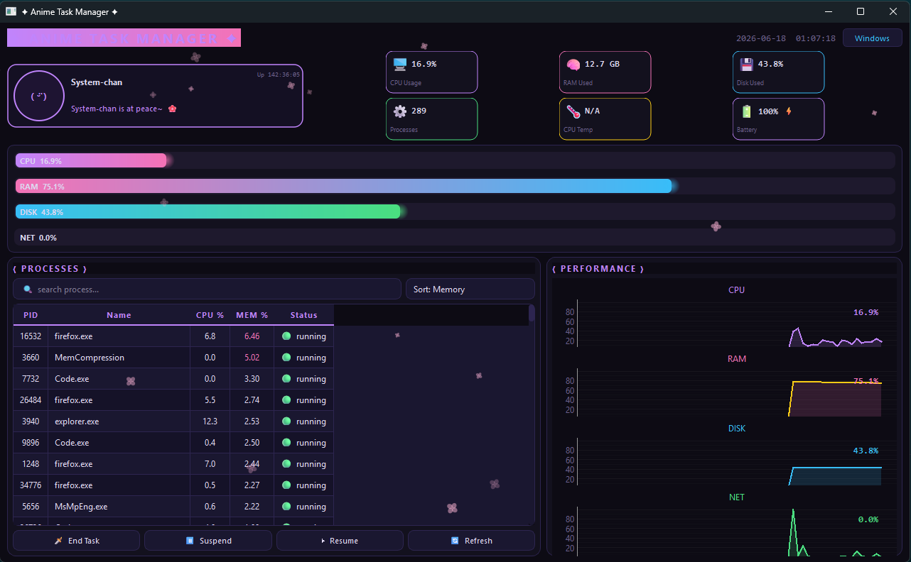

AniHigh Task Manager is one of a kind task manager i specifically decided to create for all my anime friends out there who wish to take their aesthetics to the next level, YES even with a task manager 

AniHigh is aimed to be very lightweight and coded entirely in python and has some really nice ui alongside graphs which give real time info about your system it also features multiple themes based on different anime characters 

**What's inside?**
- **SYSTEM-CHAN** - a chibi character that displays your system state with different moods (relaxed, working hard, or completely overwhelmed ) so you know at a glance how stressed your PC is
- **Performance Graphs** - animated graphs showing CPU, RAM, Disk, and Network usage with color-coded alerts
- **Process Manager** - kill, suspend, and resume processes with search and multiple sort options (by memory, CPU, name, or PID)
- **Status Badges** - quick stats showing CPU usage, RAM consumption, disk space, process count, CPU temp, and battery status
- **Uptime Counter** - track how long your machine has been running
- **Sakura Petals** - because why not add some anime aesthetic with falling cherry blossoms

Yeah that's it till now, but i'm constantly cooking up more features to make this thing even more fire

## Preview

